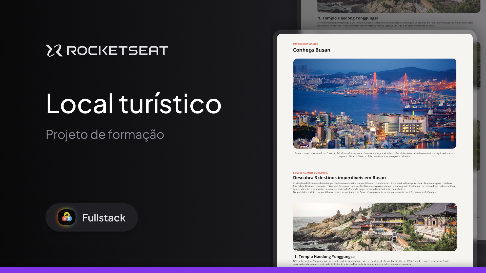

<h1 align="center">Habibi Tour 🐫</h1>

<p align="center">
  A cinematic travel experience inspired by Dubai's most iconic destinations.
</p>

<p align="center">
  
  
  
  
  
  
</p>

<p align="center">
  💛 Like the project? Give it a star and share it!
</p>

<p align="center">
  <a href="https://www.linkedin.com/sharing/share-offsite/?url=https://github.com/Janesaraujo/Habibitour-Front-End"></a>
  <a href="https://x.com/intent/tweet?text=Check%20out%20this%20project%20on%20GitHub:%20https://github.com/Janesaraujo/Habibitour-Front-End%20%23HTML%20%23TailwindCSS%20%23GSAP"></a>
  <a href="https://www.facebook.com/sharer/sharer.php?u=https://github.com/Janesaraujo/Habibitour-Front-End"></a>
  <a href="https://www.reddit.com/submit?title=Check%20out%20this%20project%20on%20GitHub:%20https://github.com/Janesaraujo/Habibitour-Front-End%20%23HTML%20%23TailwindCSS%20%23GSAP"></a>
  <a href="https://t.me/share/url?url=https://github.com/Janesaraujo/Habibitour-Front-End&text=Check%20out%20this%20project%20on%20GitHub%20%23HTML%20%23TailwindCSS%20%23GSAP"></a>
</p>

## 🌴 About the project

**Habibi Tour** is a front-end travel website inspired by a Figma design featuring some of Dubai's most iconic destinations: **Palm Jumeirah, Dubai Marina, the Dubai Desert, and Burj Khalifa**.

The original proposal for this project was intentionally simple: build a **static front-end website based on the provided design**.

However, I decided to take the project a step further.

Instead of stopping at the static implementation, I used it as an opportunity to practice and experiment with concepts I was learning **both through my course and through my own studies outside of it**.

The result is a more interactive experience with animations, navigation logic, dynamic content, responsive behavior, and several small details that were not part of the original static proposal.

For me, this project became less about simply reproducing a design and more about seeing **how far I could take the original idea with the tools and concepts I was learning**.

## 🎨 Design Reference

The project started from this Figma design, which was used as the visual reference for the original website:

<p align="center">
  <a href="https://www.figma.com/community/file/1384542229391733447/local-turistico">
    
  </a>
</p>

<p align="center">
  🎨 <a href="https://www.figma.com/community/file/1384542229391733447/local-turistico"><strong>View the original Figma design →</strong></a>
</p>

The original proposal was focused on creating a **static front-end website** based on the visual design, mainly showcasing the layout, destination cards, and overall visual identity.

From there, I decided to take the project further. I kept the core design and visual direction, but added my own ideas and implementations, turning the original static concept into a more interactive experience with **JavaScript, GSAP animations, dynamic navigation, and responsive interactions**.

The animations and interactive behavior were not part of the original Figma proposal — they were developed separately as I explored the technologies and concepts I was learning both through my course and through my own studies.

### What I added

* 🎬 **Interactive destination slider** instead of a purely static page.
* ✨ **GSAP animations** for navigation, titles, cards, and background transitions.
* 🔢 **Functional pagination** allowing users to jump between destinations.
* 🪟 **Liquid Glass interface** with translucent elements and blur effects.
* 🃏 **Interactive card hover effects** with scaling, elevation, and shadows.
* 📐 **Dynamic title sizing** so longer destination names can remain on a single line.
* ⚡ **Image preloading** to make destination changes feel smoother.
* 📱 **Responsive behavior** for different screen sizes.
* ♿ **Reduced-motion support** using `prefers-reduced-motion`.

These additions were not required by the original static website proposal. They were implemented as part of my own exploration and practice.

## 🧠 What I practiced

One of the main reasons I enjoyed working on this project was that it allowed me to put different concepts together in a single application.

During development, I practiced:

* DOM manipulation with JavaScript
* Managing application state for the slider
* CSS transitions and transforms
* Responsive layouts
* Tailwind CSS
* GSAP timelines and animations
* `clip-path` animations
* `backdrop-filter` and glassmorphism effects
* Image preloading
* CSS selectors such as `:has()`
* Accessibility considerations
* Handling interactions between CSS and JavaScript animations

Some of these concepts came from my studies, while others were things I explored independently while trying to improve the project.

## 🎞️ Going beyond the original design

A good example is the destination navigation.

The original design is static, so there was no defined behavior for switching between destinations. I wanted the transition to feel more intentional than simply replacing the text and background image.

For the **previous/next buttons**, I created a rolling text animation using GSAP and `SplitText`, making the title and description move vertically into place.

I also added a different, lighter transition when selecting destinations through the pagination or cards, keeping the more expressive animation for intentional next/previous navigation.

### A small technical challenge

The destination cards also had a hover animation where the active card grows slightly, moves upward, and receives a stronger shadow.

At first, the effect wasn't working consistently.

GSAP was leaving `transform` and `opacity` as inline styles after some animations. Since inline styles have priority over CSS rules, the `:hover` styles were being overridden.

After investigating the issue, I used `clearProps` at the end of the GSAP animations so that CSS could take control again.

It was a small problem, but it was a useful part of the development process because it made me understand better how **CSS and JavaScript animation libraries interact with the DOM**.

## 🛠️ Technologies

* **HTML5** — semantic structure
* **Tailwind CSS** — utility-based styling and layout
* **CSS** — custom effects, responsive behavior, and Liquid Glass UI
* **JavaScript** — application logic, navigation, and DOM manipulation
* **GSAP** — animations and transitions
* **Google Fonts** — Plus Jakarta Sans
* **Figma** — original visual reference

## 📁 Project structure

```text
.
├── assets/
│   ├── burj.jpg
│   ├── deserto.jpg
│   ├── marina.jpg
│   ├── palm.jpg
│   ├── figma-cover.jpg
│   ├── preview.gif
│   └── preview.mp4
├── css/
│   └── styles.css
├── js/
│   ├── script.js
│   └── tailwind.config.js
├── index.html
├── LICENSE
└── README.md
```

## 🚀 Getting started

Habibi Tour is a front-end project with interactive features built with HTML, CSS, and JavaScript. It doesn't require a build process or dependency installation, so you can run it directly in the browser.

### Clone the repository

```bash
git clone https://github.com/Janesaraujo/Habibitour-Front-End.git
```

Then open `index.html` in your browser.

For development, you can use the **Live Server** extension in VS Code to automatically reload the page whenever you make changes.

## 💻 Preview

Take a look at the live website and explore the full experience:

<p align="center">
  <a href="https://habibitour-front-end.vercel.app/">
    
  </a>
</p>

<p align="center">
  🔗 <strong><a href="https://habibitour-front-end.vercel.app/">Live Preview →</a></strong>
</p>

## 👤 Author

Developed by **Janes Araujo**

* GitHub: [@Janesaraujo](https://github.com/Janesaraujo)

## 📄 License

This project is licensed under the **MIT License**.

See the [LICENSE](LICENSE) file for more information.
